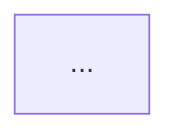

# Platform Draft Formats

How to write each platform's post file in `olav-post/archive/YYYY-MM-DD/`.
Source of truth for style: [content-strategy.md](./content-strategy.md).
All posts use `olav.md` as their content source — never copy from each other.

---

## olav.md — Master Post (EN, full article)

This is the canonical blog post. All platform drafts are derived from it.

```markdown
---
title: "..."
description: "..."
pubDate: YYYY-MM-DD
author: "OLAV Team"
tags: ["release", "platform"]
ogImage: /blog-images/<slug>/og-image.webp
---

## What's New in vX.Y.Z

[Full article with sections, mermaid diagrams, code examples]



[Continue article...]
```

---

## linkedin.md

```markdown
# LinkedIn Post — YYYY-MM-DD

[Paragraph 1: The problem or observation — set the scene. 2–3 sentences. No "I'm excited to".]

[Paragraph 2: What you tried first / what was broken before. Concrete. If you tried an approach that failed, say so.]

[Paragraph 3: What changed and specifically how. One mechanism, one number, one before/after.]

[Paragraph 4: What this means in practice — for a team, for an operator, for a deployment. Not abstract.]

[Paragraph 5 (optional): A related thing that still doesn't work well. One sentence is enough.]

[Paragraph 6: Closing — one honest sentence. Not a CTA. Not a hashtag pile.]

https://olavai.com/blog/<slug>
```

**Target audience**: IT managers, architects, tech leads  
**Minimum length**: 400 words  
**Framing angle**: Team/org impact, what breaks without this, what changes with it  
**Forbidden**: Bullets, hashtags (>2), "excited to", any hype adjective, emoji

---

## hackernews.md

```markdown
# HackerNews Submission — YYYY-MM-DD

## Title (max 80 chars)
Show HN: olav — [one-line technical description]

## Text (optional, 2–4 sentences max)
[What it does technically. The interesting implementation choice. One real limitation.]

## URL
https://olavai.com/blog/<slug>

## Subreddit
(n/a — HN has no subreddit, submitting to front page)
```

**Target audience**: Engineers who will read your code, not your marketing
**Framing angle**: Implementation detail or architecture decision that's genuinely interesting
**Forbidden**: Feature lists, "powerful/seamless", any claim you can't back with code

---

## reddit.md

```markdown
# Reddit Post — YYYY-MM-DD

## Subreddit
r/selfhosted  (primary)
r/devops      (secondary — post 48h later if r/selfhosted gets traction)
r/homelab     (optional)

## Title
[Concrete factual title. No adjectives. State what it does, ideally with a number or specific claim.]

## Body

[Paragraph 1: What it is, one sentence. Then: why it exists — the problem it was built to solve, in concrete terms.]

[Paragraph 2: What the problem looks like without this tool. Give a real scenario. Be specific enough that someone who's hit this knows exactly what you mean.]

[Paragraph 3: How it works technically. Not a feature list — explain the mechanism. "The way it works is..." Include a code block or CLI example if there's one worth showing.]

[Paragraph 4 (optional): What it does NOT do or handle yet. Things still broken. Real known limitations, not "there are some edge cases".]

[Paragraph 5: Comparison to alternatives if relevant — what would you use instead, and why might someone prefer that.]

[Paragraph 6: Genuine question to community — not rhetorical, not "what do you think?". Specific enough to prompt a useful answer.]

[Raw URL — no markdown formatting]
https://github.com/james-olavai/olav
https://olavai.com/blog/<slug>

## Flair
tool / project / discussion
```

**Minimum length**: 500 words  
**Forbidden**: Marketing tone, cross-promoting same day, identical title to HN post

---

## zhihu.md

```markdown
# 知乎文章 — YYYY-MM-DD

## 标题
[具体的技术问题或结论 — 不要用"如何"开头，用陈述式或问句，例如"为什么我们选择X而不是Y？"]

## 摘要
[2-3 句话，说清楚本文回答什么问题，为什么值得读。知乎会显示这段作为预览。]

---

## 背景：这个问题从哪里来？

[描述促使这个设计决策或技术选择的具体场景。不是"AI很重要"，而是"我们在做X时遇到了Y问题"。
2-3段，每段3-5句。]

## [核心机制/设计/方案名称]

[解释核心设计。包含架构图（以公开图片URL嵌入，或描述），说明各部分的职责。
重点：解释为什么这样设计，而不是只说是什么。至少包含一个被放弃的备选方案及其原因。]


## 实现细节

[深入一个技术细节。包含代码片段或伪代码，解释关键函数/配置的设计意图。
不需要覆盖所有实现——选最有技术含量的一个讲透。]

```python
# 关键代码，带注释解释设计决策（不是只解释语法）
```

## 性能 & 实测数据

[具体数据，有对比基线。不是"显著提升"，而是"从 Xms 降至 Yms，测试条件：Z"。
说明测试方法，让读者知道数字是在什么条件下得到的。]

## 局限性与已知问题

[诚实列出当前不能做的事。这一节越诚实，读者越信任你。
至少3条，每条1-2句说明根本原因，不只是症状。]

## 延伸思考

[给读者留一个开放问题：你们是怎么解决类似问题的？有没有更好的方案？
不要是CTA，是真正的技术问题。]

---

## 参考
- [OLAV 博客原文（EN）](https://olavai.com/blog/<slug>)
- [GitHub](https://github.com/james-olavai/olav)
```

**目标字数**: 2000–5000 汉字  
**必须有**: 架构图（URL方式嵌入）、代码片段、性能数据、局限性、延伸问题  
**禁止**: 纯功能宣传、没有数据的性能描述、emoji

---

## juejin.md

```markdown
# 掘金文章 — YYYY-MM-DD

## 标题
[动手实践角度，例如"用 olav 给你的 AI Agent 加上四层防护——从踩坑到可用"]

## 封面图
本地路径（上传用）: /path/to/project/olav-web/public/blog-images/<slug>/og-image.webp  
发布后替换为掘金 CDN 链接

## 标签
后端、工具、运维、Python（按实际选择，3–5个）

---

## 正文

[开头2-3句：直接说清楚"这篇文章教你做什么"，以及你遇到了什么问题促使写这篇文章。]

### 背景：踩了什么坑

[具体讲清楚你遇到的问题。不是"AI有局限性"这种废话，而是"我在做X的时候，Y发生了，
导致Z结果"。2-3段，每段控制在5句以内。]

### 解决思路

[解释你的思考过程。为什么想到这个方案？有没有试过别的方案失败了？
包含架构图或流程说明（用文字或公开URL图片）。]

### 核心实现

[最重要的代码片段，带注释。重点解释"为什么这样写"，而不是"这段代码做什么"（读者看得懂语法）。]

```python
# 示例代码，注释解释设计意图
```

### 另一个关键点（或：踩坑记录）

[实际操作中发现的意外问题，或者第二个重要实现点。]

```bash
# CLI 示例或配置示例
```

### 实际效果

[测试结果或对比数据。格式参考：
"改造前：每次都调用 API，平均 800ms；改造后：命中缓存时 <1ms，覆盖率约60%的查询"
如果有性能对比表，用 Markdown 表格。]

### 已知问题 & 下一步

[哪些场景还不支持，打算怎么解决（或者为什么暂时不解决）。]

---

原文：https://olavai.com/blog/<slug>  
GitHub：https://github.com/james-olavai/olav
```

**目标字数**: 1500–3000 汉字（含代码）  
**必须有**: 2+ 代码片段、1个踩坑/意外、具体效果数据  
**禁止**: 无代码纯概念文章、抽象功能列表

---

## wechat-mp.md

```markdown
# 微信公众号文章 — YYYY-MM-DD

## 标题
[故事或场景驱动，例如"当AI开始帮你改配置，谁来负责那条删错的命令？"]

## 封面图
本地路径（上传用）: /path/to/project/olav-web/public/blog-images/<slug>/og-image.webp  
发布后替换为微信CDN链接

## 摘要（公众号推送预览，150字以内）
[一句话概括文章核心价值，让用户决定是否点开。不是标题的复述。]

---

## 正文

[**钩子开头：一个具体场景，1-2段，要有画面感。**
例如："凌晨两点，一位运维工程师收到了告警。她打开终端，照着文档输入了一条命令——
然后发现这条命令在半年前的固件版本里语法已经变了。AI 帮她生成的，信息来自两年前的文档。"
不要用"大家好，今天介绍..."开头。]

[**问题的本质（2-3段）：**
为什么这个问题难解决？之前的做法是什么，为什么不够好？
用类比让非技术读者也能理解（例如：把审计链比作银行的流水记录）。
不要跳到解决方案——先让读者感受到问题的真实重量。]

[**解决方案叙事（3-4段）：**
olav 是怎么解决这个问题的？用叙事口吻，而不是功能列表。
核心机制用类比解释：**加粗**关键术语第一次出现时。
允许用一个简短的 CLI 示例（但控制在3行以内，并用文字解释发生了什么）。]

[**真实效果（1-2段）：**
具体数字，不是形容词。测试条件要说清楚。
如果有用户反馈或真实使用场景，这里是放的地方。]

[**诚实的局限性（1段）：**
这个工具还不能做什么？在什么场景下不适合用？
这段越诚实，读者越信任整篇文章。]

[**结尾反问（1段）：**
不是"快来试用吧"，而是一个让读者思考的问题。
例如："当自动化工具开始替代人做决策，我们该如何定义'负责任的自动化'？"]

---

*原文及技术细节：[阅读原文](https://olavai.com/blog/<slug>)*
（仅可在公众号文末以"阅读原文"方式添加链接，正文内不含外链）
```

**目标字数**: 2000–4000 汉字  
**必须有**: 钩子场景、类比解释、真实数据、局限性、结尾反问  
**禁止**: 正文内外链（微信会屏蔽）、代码块超过2个、AI腔黑名单词汇

---

## netbox-community.md

```markdown
# NetBox Community Post — YYYY-MM-DD

## Target Channel
Slack: #show-and-tell or #integrations
Discourse: Community Projects

## Title / Opening
[Open-Source Card + Specific NetBox Feature]
Hi everyone! I'm the maintainer of OLAV, an open-source CLI tool designed for AI-native infrastructure operations. We just released an update that makes querying NetBox via natural language even easier.

## Message Body

**What it does for NetBox users:**
- `olav registry register http://netbox:8000` — Registers your NetBox instance in 1 command without running separate MCP servers.
- `olav "how many devices are in NetBox?"` — Instant schema-aware natural language query.
- `olav --agent netops "compare OLAV database vs NetBox — are they in sync?"` — Cross-source verification.

**Safety First:**
We know giving AI access to infrastructure is scary. OLAV includes 7-Layer Write Security (`--enable-api-write` lock, dry-run simulation required before write actions).

**Quick Links:**
- GitHub: https://github.com/james-olavai/olav
- Docs: https://docs.olavai.com
```

**Target audience**: NetBox users, network engineers, IPAM/DCIM admins  
**Framing angle**: Simplifying NetBox querying via natural language, zero MCP server overhead, 7-layer write security  
**Forbidden**: Generic marketing fluff, posting in `#general`

---

## ntc-slack.md

```markdown
# Network to Code (NTC) Slack Post — YYYY-MM-DD

## Target Channel
#tooling or #showcase

## Message Body
Hi all! Sharing a quick update on **OLAV** — an open-source Python CLI for AI-native network & infrastructure ops (`pip install olav`).

In this release:
1. **Single Command API Registration**: Connect NetBox or any OpenAPI endpoint (`olav registry register <url>`) — no MCP server process required.
2. **Strict Agent Isolation**: Core, Ops, and Audit agents operate with least-privilege toolsets.
3. **Safety Controls**: Read-only by default with 7-layer write protection for production devices.

Quick 60-second setup:
```bash
pip install olav
olav registry register http://netbox:8000
olav "list all active switches"
```

GitHub: https://github.com/james-olavai/olav
Feedback & PRs welcome!
```

**Target audience**: Network automation engineers, Nornir/Ansible users  
**Framing angle**: Developer experience, Python CLI, zero-friction install  

---

## v2ex.md

```markdown
# V2EX 社区帖子 — YYYY-MM-DD

## 节点
/go/create (分享创造) 或 /go/devops

## 标题
[分享创造] OLAV: 一条命令用自然语言查询 NetBox 与网络基础设施（开源 Python CLI）

## 正文

### 1. 开源介绍 (Open Source Card)
大家好，我是开源项目 **OLAV** 的开发者。OLAV 是一个专为网络工程师与 SRE 打造的 AI 原生基础设施运维 CLI 工具。

### 2. 解决什么问题？
在做网络自动化或接入 NetBox 时，我们发现传统 MCP 架构需要为每个服务维护后台进程和传输协议，部署繁琐。
OLAV 采用了 **API-as-Service (Beyond MCP)** 机制：
- 一条命令注册 OpenAPI/REST API：`olav registry register http://netbox:8000`
- 自动提取 Schema 并转为精简 Markdown 索引
- 核心 Agent 具备 Schema-Aware 能力，直接生成正确格式的 REST 请求

### 3. 极简 60 秒体验
```bash
pip install olav
olav registry register http://netbox:8000
olav "NetBox 里有多少台设备？"
```

### 4. 关于网络安全的硬防线
针对生产环境配置变更的担忧，OLAV 内置了 **7 层安全保护**：
- 默认只读（`--enable-api-write` 锁）
- 所有写操作必须强制经过 Dry-run 模拟通过

### 5. 链接与欢迎反馈
- GitHub: https://github.com/james-olavai/olav
- 文档: https://docs.olavai.com

欢迎大家试用、提 Issue 或 Star！
```

**目标字数**: 800–1500 汉字  
**必须有**: [分享创造] 标头、开源身份、60秒体验步骤、7层安全防护机制、GitHub 链接  

