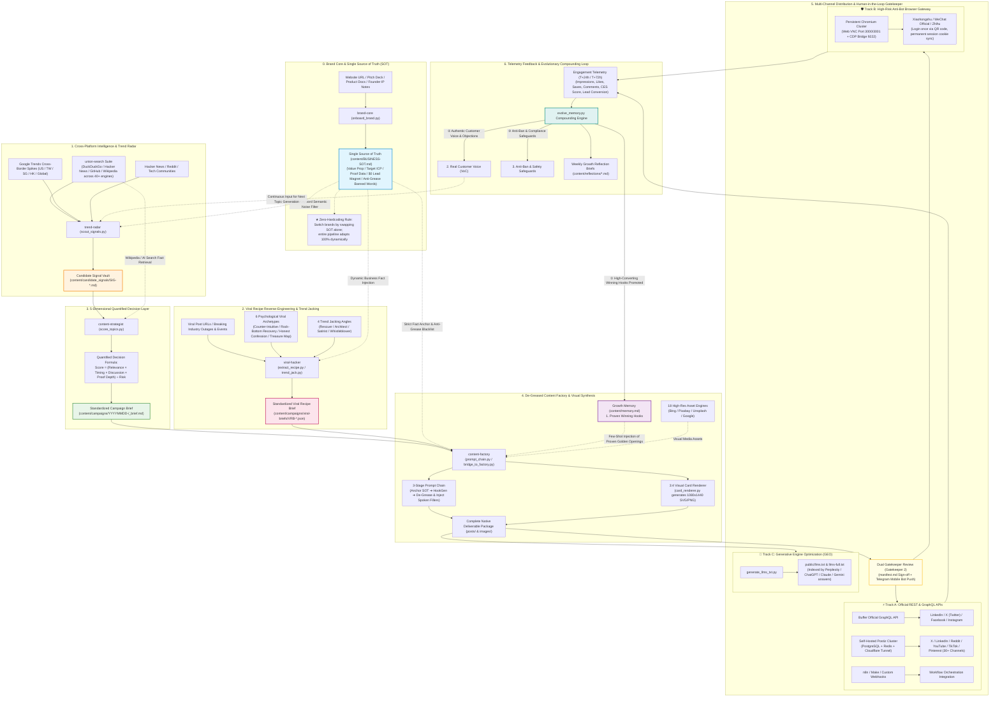

# 🚀 olav-growth: Autonomous Agentic Growth Engine

[English](README.md) | [简体中文](README_zh.md)

[](LICENSE)
[](https://www.python.org/downloads/)
[](#3-core-architecture--skill-modules)
[](#1-the-90-day-content-snowball-flywheel)

> **olav-growth** is an open-source, production-grade **Autonomous Growth & Content Pipeline** engineered for technical founders, growth engineers, and modern product teams.  
> Powered by an interconnected multi-agent architecture, it orchestrates the entire growth cycle: **Single Source of Truth (SOT) Grounding ➔ Real-Time Trend & Competitor Radar ➔ 5-Dimensional Quantified Decision Scoring ➔ De-Greased Native Content Generation ➔ Multi-Channel Matrix Distribution ➔ Self-Evolving Compounding Memory**.

---

## 📑 Table of Contents

- [1. The 90-Day Content Snowball Flywheel](#1-the-90-day-content-snowball-flywheel)
- [2. Supported Ecosystem & Platform Matrix](#2-supported-ecosystem--platform-matrix)
- [3. Core Architecture & Skill Modules](#3-core-architecture--skill-modules)
- [4. Distribution Infrastructure & Gatekeeper](#4-distribution-infrastructure--gatekeeper)
- [5. Infrastructure Deployment Guide](#5-infrastructure-deployment-guide)
  - [1. Self-Hosted Postiz Cluster (with Cloudflare Tunnel)](#1-self-hosted-postiz-cluster-with-cloudflare-tunnel)
  - [2. Persistent Chromium Web VNC + CDP Cluster](#2-persistent-chromium-web-vnc--cdp-cluster)
- [6. Field Guide & Troubleshooting](#6-field-guide--troubleshooting)
- [7. Quick Start & Daily Automated Workflow](#7-quick-start--daily-automated-workflow)
  - [1. Connectivity Self-Diagnostic](#1-connectivity-self-diagnostic)
  - [2. Chinese Platform Session Sync (One-time QR Code)](#2-chinese-platform-session-sync-one-time-qr-code)
  - [3. One-Click Multi-Channel Publishing](#3-one-click-multi-channel-publishing)
- [8. Union Search & Intelligence Suite](#8-union-search--intelligence-suite)
- [9. Viral Hacker & Trend Jacking](#9-viral-hacker--trend-jacking)
- [10. Principles & Core Tenets](#10-principles--core-tenets)

---

## 1. The 90-Day Content Snowball Flywheel

The pipeline enforces an unbroken compounding loop from business reality to distribution, feeding empirical engagement data back into evolutionary memory:



---

## 2. Supported Ecosystem & Platform Matrix

| Business Stage | Channels / Protocols / Integrations | Automation Paradigm | Configuration / Credentials |
| :--- | :--- | :--- | :--- |
| **Global Channels (Official API)** | **LinkedIn**, **X (Twitter)**, **Facebook**, **Instagram** | Buffer GraphQL API direct scheduling and publishing | `BUFFER_ACCESS_TOKEN`<br>`BUFFER_PROFILE_IDS` |
| **Global Channels (Self-Hosted)** | **X**, **LinkedIn**, **Reddit**, **YouTube**, **TikTok**, **Pinterest** (30+ platforms) | Self-Hosted Postiz cluster (PostgreSQL 15 + Redis 7 + Cloudflare Tunnel) | `POSTIZ_API_URL`<br>`POSTIZ_API_KEY` |
| **Chinese Channels (Anti-Bot Session)** | **Xiaohongshu (RED)**, **WeChat Official Account**, **Zhihu Column** | Persistent Chromium container (Web VNC + 9222 CDP bridge automatic cookie sync) | `XHS_COOKIE`<br>`ZHIHU_COOKIE` |
| **Human-in-the-Loop Audit** | **Telegram Bot** (Broadcast & Approve/Reject inline mobile keyboard), `manifest.md` | Dual gatekeeper review to eliminate hallucinations and policy violations | `TELEGRAM_BOT_TOKEN`<br>`TELEGRAM_CHAT_ID` |
| **Real-time Intelligence** | **Google Trends** (Cross-border), **Hacker News**, **DuckDuckGo**, **360**, **Sogou**, **GitHub**, **Wikipedia** (40+ engines) | `union-search` CLI unified multi-platform search, zero API key required | Optional tokens: `TAVILY_API_KEY`, `TIKHUB_TOKEN` |
| **Visual Media Generation** | **Bing**, **Pixabay**, **Unsplash**, **Google**, **Baidu**, **Volcengine** (18 image engines) | High-res commercial asset scraper & 3:4 viral card synthesizer (`card_renderer.py`) | Out-of-the-box local rendering |
| **AI Answer Engines (GEO)** | **Perplexity**, **ChatGPT Search**, **Claude**, **Gemini** | Automated generation of standard `llms.txt` and `llms-full.txt` from `BUSINESS-SOT.md` | Static generator (`public/`) |
| **Evolutionary Memory** | **Obsidian** compatible bidirectional vault (`content/memory.md` & `BUSINESS-SOT.md`) | `evolve_memory.py` automatically promotes winning hooks, saves customer voice, and logs weekly reviews | Git-versioned knowledge vault |

---

## 3. Core Architecture & Skill Modules

The codebase is organized into 8 modular agentic skills adhering to unix-like composition:

```
olav-growth/
├── .agent/skills/
│   ├── brand-core/            # Single Source of Truth (SOT) and growth memory (memory.md)
│   ├── trend-radar/           # Real-time intelligence radar (Google Trends / HN / Union Search)
│   ├── viral-hacker/          # Viral post reverse-engineering, archetype extraction & trend jacking
│   ├── content-strategist/    # 5-dimensional quantified topic evaluation & campaign briefing
│   ├── content-factory/       # De-greased content synthesis & 3:4 visual card rendering
│   ├── growth-distribution/   # Matrix publishing, human gatekeeper & channel dispatchers
│   ├── docs-kb/               # Multi-format corporate document ingestion, classification & search
│   └── union-search/          # 40+ search engines & 18 image downloaders (symlink tools/union-search)
├── tools/
│   └── union-search/          # Standalone unified search CLI and engine adapters
├── deploy/
│   ├── browser/               # Persistent Chromium container stack (Web VNC + CDP Bridge)
│   └── postiz/                # Self-hosted Postiz cluster (Postgres, Redis, Cloudflare Tunnel)
└── content/                   # Obsidian-compatible Content Vault
```

---

## 4. Distribution Infrastructure & Gatekeeper

To balance account security against publishing volume, **olav-growth** uses a 3-tier distribution strategy:

| Tier | Target Platforms | Technology Stack | Automation Level | Security & Anti-Ban |
| :--- | :--- | :--- | :--- | :--- |
| **Tier 1 (Direct API)** | LinkedIn, X, Facebook, Instagram | **Buffer GraphQL API** & **Postiz Cluster** | 100% Scheduled & Dispatched via API | Zero risk of account restriction; official OAuth credentials |
| **Tier 2 (Browser Session)** | Xiaohongshu, WeChat, Zhihu | **Persistent Chromium (CDP + Web VNC)** | QR scan once in browser, auto-extract cookies to `.env` | Retains realistic browser fingerprint, canvas, and WebGL context |
| **Tier 3 (GEO)** | Perplexity, ChatGPT, Claude | **Generative Engine Optimization** | Compiled static `llms.txt` | Direct inclusion in LLM retrieval indices |

---

## 5. Infrastructure Deployment Guide

### 1. Self-Hosted Postiz Cluster (with Cloudflare Tunnel)

Postiz provides self-hosted scheduling for over 30 global platforms. To comply with OAuth callback constraints, it runs alongside Cloudflare Tunnel:

```bash
# 1. Initialize environment templates
python3 deploy/postiz/setup_env.py

# 2. Configure Cloudflare Tunnel in deploy/postiz/.env
#    - CLOUDFLARE_TUNNEL_TOKEN="your_token"
#    - MAIN_URL="https://postiz.yourdomain.com"

# 3. Launch production stack (Postiz + Postgres 15 + Redis 7 + Cloudflared)
./deploy-postiz.sh
```

### 2. Persistent Chromium Web VNC + CDP Cluster

For platforms that enforce strict slide captchas and QR code authentication (Xiaohongshu, WeChat):

```bash
./deploy-browser.sh
```

Once running:
* **LAN HTTPS Web Access (Recommended)**: `https://<YOUR_SERVER_IP>:3001`
* **Local Machine HTTP**: `http://localhost:3000`
* **Agent Remote CDP Bridge**: `http://127.0.0.1:9222`
* **Session Storage Directory**: `deploy/browser/chrome-profile/` (cookies, local storage, extensions persist across restarts)

---

## 6. Field Guide & Troubleshooting

### 【Postiz】Why Cloudflare Tunnel is Mandatory
1. **OAuth Strictness**: X, LinkedIn, Meta, and Reddit reject HTTP and private IP addresses in redirect URIs (e.g. `http://192.168.x.x:5000/api/...` is immediately rejected). A trusted public HTTPS domain is required.
2. **RFC 6265 Cookie Partitioning**: Next.js and NestJS issue session cookies scoped to hostnames. Accessing via raw IP addresses causes browsers to drop session cookies, resulting in login loops.
3. **Zero Port Forwarding**: Cloudflare Tunnel connects via outbound TLS tunnels—no router port forwarding or public IP exposure required.

### 【Browser】Error: This application requires a secure connection (HTTPS)
* **Root Cause**: Modern Web VNC implementations (Selkies / KasmVNC) utilize WebCodecs & WebRTC for hardware-accelerated video streaming. Chromium browsers designate all raw LAN IP addresses over HTTP as "Insecure Contexts", actively disabling video decoding APIs.
* **Solutions**:
  1. Access via **HTTPS 3001**: `https://<YOUR_SERVER_IP>:3001` (Accept self-signed certificate).
  2. Or configure Chrome flag: `chrome://flags/#unsafely-treat-insecure-origin-as-secure` with `http://<YOUR_SERVER_IP>:3000`.
  3. Or create an SSH tunnel: `ssh -L 3000:localhost:3000 user@<YOUR_SERVER_IP>` and visit `http://localhost:3000`.

### 【Browser】CDP Port 9222 Connection Reset by Peer
* **Root Cause**: Modern Chromium binds remote debugging strictly to `127.0.0.1`. Requests originating from outside the container are dropped by default.
* **Solution**: `deploy/browser/custom-cont-init.d/01-init-env.sh` automatically launches an internal SOCAT bridge proxying traffic between container loopback `127.0.0.1:9223` and public interfaces on port `9222`.

---

## 7. Quick Start & Daily Automated Workflow

### 1. Connectivity Self-Diagnostic

Verify all active channel credentials and services with a single command:

```bash
python .agent/skills/growth-distribution/scripts/publish/test_connections.py
```

Expected diagnostic output:
```text
==================================================================
 📡 Olav Growth: Publishing System & API Connectivity Diagnostic
==================================================================
✅ Buffer GraphQL API             | CONNECTED       | User: contact@olav.ai     | Channel: [linkedin] Olav Growth
✅ Postiz Gateway (Self-Hosted)   | CONNECTED       | Public API v1 Verified (0 connected integrations)
✅ Telegram Bot (Mobile Gatekeeper) | CONNECTED       | Bot: @olav_growth_bot
✅ Persistent Browser (CDP & VNC) | CONNECTED       | Chromium CDP Bridge (Port 9222) Active
```

### 2. Chinese Platform Session Sync (One-time QR Code)

1. Open `https://<YOUR_SERVER_IP>:3001` in your desktop browser.
2. Navigate to creator portals and scan QR codes with mobile apps:
   - Xiaohongshu: `https://creator.xiaohongshu.com`
   - Zhihu Column: `https://zhuanlan.zhihu.com`
   - WeChat Official: `https://mp.weixin.qq.com`
3. Run the cookie sync script:
   ```bash
   python .agent/skills/growth-distribution/scripts/publish/sync_browser_cookies.py
   ```
   *The script retrieves valid session tokens via the 9222 CDP bridge and saves them into `.env` automatically.*

### 3. One-Click Multi-Channel Publishing

```bash
# Push scheduled LinkedIn post via Buffer
python .agent/skills/growth-distribution/scripts/publish/publish_api.py \
  --channel buffer \
  --campaign content/campaigns/20260921-olav-dockb-launch \
  --profile-name "Olav Growth"

# Publish across self-hosted Postiz networks
python .agent/skills/growth-distribution/scripts/publish/publish_api.py \
  --channel postiz \
  --campaign content/campaigns/20260921-olav-dockb-launch
```

---

## 8. Union Search & Intelligence Suite

**union-search** provides a multi-platform search CLI requiring zero external API keys for core platforms:

```bash
# 1. Search Hacker News for discussions
python tools/union-search/union_search_cli.py search "AI marketing" --engine hackernews --limit 5

# 2. Search GitHub repositories
python tools/union-search/union_search_cli.py search "agentic workflow" --engine github --limit 5

# 3. Retrieve Wikipedia knowledge
python tools/union-search/union_search_cli.py search "Retrieval-augmented generation" --engine wikipedia

# 4. Scrape high-resolution commercial images across 18 platforms
python tools/union-search/scripts/union_image_search/multi_platform_image_search.py \
  --keyword "developer workspace" \
  --platforms bing,pixabay,unsplash \
  --limit 5 \
  --download
```

---

## 9. Viral Hacker & Trend Jacking

Reverse-engineer high-performing posts into pure structural formulas and hijack breaking industry moments:

```bash
# 1. Extract structural formula from any viral post
python .agent/skills/viral-hacker/scripts/extract_recipe.py \
  --url "https://example.com/viral-post" \
  --formula honest_confession

# 2. Jack a live breaking trend / competitor outage
python .agent/skills/viral-hacker/scripts/trend_jack.py \
  --event "Major SaaS Tool Outage & 50% Price Hike" \
  --angle rescuer

# 3. Synthesize deliverables and render 3:4 visual cards
python .agent/skills/viral-hacker/scripts/bridge_to_factory.py \
  --brief content/campaigns/viral-briefs/VRB-example.json
```

---

## 10. Principles & Core Tenets

1. **Single Source of Truth (SOT) Primacy**:
   Zero business facts are hardcoded in prompts or code. The entire business model, ICP pain points, proof metrics, and banned words reside strictly in `content/BUSINESS-SOT.md`. Swapping SOT allows the engine to pivot to any new industry instantly.
2. **Strict De-Greasing (No AI Fluff)**:
   Three-stage prompt chains sanitize text against corporate jargon (`empower`, `paradigm shift`, `synergize`, `holistic solution`), infusing colloquial connectors and tangible execution details.
3. **Structure vs. Substance Separation**:
   Winning engagement formulas from social media are treated as abstract mathematical templates, populated purely with verified facts from the SOT.
4. **Human-in-the-Loop Safeguards**:
   High-risk platforms require explicit mobile authorization via Telegram bot or signed `manifest.md` before any payload leaves the server.

---

## 📄 License

This project is open-sourced under the [MIT License](LICENSE).
