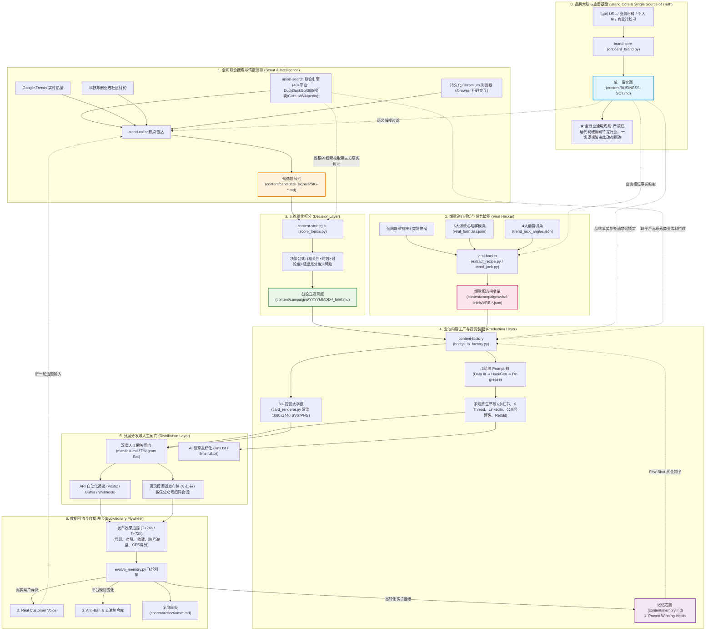

# olav-growth: 智能体增长操作系统全景指南 (agent.md)

> 本文档是整个营销自动化操作系统（Marketing OS）的**终极使用指南、架构白皮书与 Agent 系统指令规范**。
> 系统基于硅谷先进的 AI Agent 范式与商业增长闭环构建，实现了从**品牌入驻冷启动 ➔ 全网联合搜索 ➔ 实时热点侦测 ➔ 爆款逆向解构 ➔ 5维量化决策 ➔ 3阶段去油内容工厂 ➔ 分层矩阵发布 ➔ 数据回流自进化**的**全闭环营销操作系统**。

---

## 一、系统闭环全景图 (Flywheel Architecture)



---

## 二、项目目录结构规范

```text
olav-growth/
├── agent.md                       # 系统总览与操作手册（本文档）
├── README.md                      # 开源主文档与快速启动指南
├── .env                           # 敏感 API 密钥与账户凭证（受 .gitignore 保护）
├── .env.example                   # 密钥配置模板（含分发、爬虫与联合搜索配置）
├── config.json                    # 项目全局声明式配置（平台开关、默认参数与路径）
├── content/                       # 营销内容资产库 (Content Vault，可直接用 Obsidian 打开)
│   ├── BUSINESS-SOT.md            # 品牌大脑与唯一真相源 (Single Source of Truth)
│   ├── memory.md                  # 记忆右脑与进化数据池 (Growth Memory)
│   ├── config.yaml                # docs-kb 扫描与分类规则配置
│   ├── candidate_signals/         # 候选信号池 (SIG-YYYYMMDD-XX.md)
│   ├── campaigns/                 # 营销战役独立归档包
│   │   ├── viral-briefs/          # 爆款配方指令单 (VRB-*.json & VRB-*.md)
│   │   └── YYYYMMDD-<slug>/       # 单次战役全套资产包
│   │       ├── _brief.md          # 选题立项简报与五维打分卡
│   │       ├── manifest.md        # 发布清单、过审签名与效果追踪表
│   │       ├── xhs_post.md        # 小红书原生文案（带 CES 算法暗号）
│   │       ├── x_thread.md        # X (Twitter) 5屏线程
│   │       ├── linkedin_post.md   # LinkedIn 行业洞察长帖
│   │       ├── blog_post.md       # 微信公众号 / 博客深度长文
│   │       ├── cover_card.svg     # 3:4 视觉大字报封面 (1080x1440)
│   │       └── assets/            # 交付物（白皮书、PDF 避坑清单、下载素材）
│   ├── reflections/               # 战役复盘与技能进化周报
│   └── templates/                 # 各平台文案 Markdown 标准骨架
├── .agent/skills/                 # 8 大核心专业技能工具箱
│   ├── brand-core/                # 品牌画像建模、SOT 管理与记忆进化中枢
│   ├── trend-radar/               # 热点雷达与多源信号抓取
│   ├── union-search/              # 跨40+平台联合搜索与18平台图片下载 (软链接 tools/union-search)
│   ├── viral-hacker/              # 爆款逆向解构、骨架模具提取与实时热点借势破圈
│   ├── content-strategist/        # 五维量化打分与选题企划
│   ├── content-factory/           # 3阶段 Prompt 链、去油自检与 3:4 视觉大字报
│   ├── growth-distribution/       # 闸门清单、多端发布 (Postiz/Buffer) 与 GEO 优化
│   └── olav-dockb/                # 全局文档知识库索引、检索与分类
├── tools/
│   └── union-search/              # 联合搜索统一 CLI 与多平台引擎库
└── deploy/
    ├── postiz/                    # 自建开箱即用的 Postiz 分发矩阵容器 (PostgreSQL+Redis+CF Tunnel)
    └── browser/                   # 持久化 Chromium + Web VNC (端口 3000/3001) + CDP (9222)
```

---

## 三、全行业通用与零硬编码准则 (Universal & Zero-Hardcoding)

本系统是**完全面向全行业通用的营销操作系统**。为了保证系统在任何商业实体（如：法律咨询、实体连锁、K12教育、健身轻食、B2B工业品、跨境电商、独立开发或开源 SaaS）中均能丝滑运行，全系统严格贯彻以下三项铁律：

### 1. 唯一底层事实原则 (Single Source of Truth)
- 全系统**严禁在底层代码、Prompt 模版或脚本中硬编码任何具体行业、职业角色或业务痛点**（例如：“独立开发”、“写代码”、“防封号”、“SaaS”等）。
- 所有业务事实、受众角色 (Target ICP)、高频痛点原声、价值主张、禁令黑名单与 $0 免费诱饵，**必须严格且仅从 [`content/BUSINESS-SOT.md`](content/BUSINESS-SOT.md) 中动态提取**！
- 任何脚本在未读取到具体字段时，仅允许使用中性通用描述（如“行业从业者与决策人”、“核心业务交付与稳健增长”）作为 Fallback，严禁夹带特定行业私货。

### 2. 模具与内容彻底解耦 (Structure Separated From Substance)
- `viral-hacker` 抽取的只是跨行业通用的人类心理学情绪节拍（如：反常识认知差、绝望触底反弹、血泪踩坑自爆、极客藏宝清单）。
- 灌装的内容 100% 来源于本品牌的单一事实源。**“借壳不借肉”**是避免同质化降权与抄袭风险的根本保障。

### 3. 三分钟零摩擦换壳入驻
当需要为新品牌或新业务运行本系统时：
1. 运行 `python .agent/skills/brand-core/scripts/onboard_brand.py`，传入新业务的官网 URL、落地页或一段业务介绍；
2. 系统自动生成全新的 `content/BUSINESS-SOT.md`；
3. 后续所有的热点匹配、爆款模仿、文案撰写与大字报渲染，将**在零代码修改的情况下 100% 自动对齐新行业**！

---

## 四、八大核心专业技能手册与常用指令速查

### 1. `brand-core` (品牌大脑与记忆中枢)
* **核心职责**：管理单一事实源（`BUSINESS-SOT.md`）与记忆进化池（`memory.md`）。
* **常用命令**：
  ```bash
  # 模式 A：从任意官网/落地页一键入驻建模
  python .agent/skills/brand-core/scripts/onboard_brand.py --url "https://mybusiness.com"

  # 模式 B：从一段自然语言业务介绍建模
  python .agent/skills/brand-core/scripts/onboard_brand.py --persona "专业财税法务团队，专注于为成长型企业提供合规避坑与股权设计方案"

  # 校验 SOT 事实源 5 大核心字段完整度
  python .agent/skills/brand-core/scripts/init_brand.py --validate

  # 运行飞轮自进化：分析已发布战役，提取爆款钩子写入 memory.md
  python .agent/skills/brand-core/scripts/evolve_memory.py --evolve
  ```

### 2. `union-search` (全网多平台联合搜索与图片中枢)
* **核心职责**：整合 40+ 搜索引擎与社媒平台，支持免 API Key 通用搜索与 18 平台图片批量下载。
* **常用命令**：
  ```bash
  # 1. 跨平台联合搜索 (GitHub, Reddit)
  python tools/union-search/union_search_cli.py search "行业关键词" --group dev --preset small

  # 2. 免 Key 通用搜索引擎极速调研
  python tools/union-search/union_search_cli.py platform duckduckgo_html "获客与转化痛点" --limit 5
  python tools/union-search/union_search_cli.py platform so360_direct "行业标杆解决方案" --limit 5

  # 3. 维基百科权威概念提取
  python tools/union-search/union_search_cli.py platform wikipedia "专业定义" --limit 2

  # 4. 18 平台高质感图片批量搜索下载 (用于 3:4 视觉大字报素材)
  python tools/union-search/union_search_cli.py image "minimalist modern business" \
    --platforms bing pixabay unsplash --limit 2 --output-dir content/campaigns/assets/

  # 5. 系统连通性与 API 状态体检
  python tools/union-search/union_search_cli.py doctor
  ```

### 3. `trend-radar` (实时热点雷达与信号侦测器)
* **核心职责**：免 API Key 跨国抓取热搜，对齐 SOT 业务痛点，沉淀候选信号卡。
* **常用命令**：
  ```bash
  # 抓取 Google Trends 台湾/香港/美国实时搜索爆发词
  python .agent/skills/trend-radar/scripts/fetch_google_trends.py --geo TW --limit 10

  # 抓取指定区域热点并自动转为候选信号卡存入 content/candidate_signals/
  python .agent/skills/trend-radar/scripts/fetch_google_trends.py --geo US --limit 10 --emit-signals

  # 联合全网侦测：自动匹配 SOT 关键词并批量生成信号卡
  python .agent/skills/trend-radar/scripts/scout_signals.py --geos US,TW,SG
  ```

### 4. `viral-hacker` (爆款逆向模仿与借势破圈引擎)
* **核心职责**：逆向解构全网爆款，提取底层心理学公式与节拍器，结合 SOT 生成配方指令单并一键交付成文。
* **常用命令**：
  ```bash
  # 1. 逆向拆解任意爆款链接，提取骨架并一键生成全套草稿与 3:4 视觉大字报
  python .agent/skills/viral-hacker/scripts/extract_recipe.py \
    --url "https://twitter.com/example/status/123456" \
    --to-factory

  # 2. 全网搜索特定高赞话题并自动复刻结构
  python .agent/skills/viral-hacker/scripts/extract_recipe.py \
    --search "行业避坑实操复盘" \
    --to-factory

  # 3. 突发热点闪电借势与流量拦截 (Trend Jacking)
  python .agent/skills/viral-hacker/scripts/trend_jack.py \
    --topic "突发行业大事件/竞品变动" \
    --angle rescuer \
    --to-factory
  ```

### 5. `content-strategist` (量化决策与选题架构师)
* **核心职责**：执行五维决策公式 `(Relevance*Timing*Discussion*Evidence)/Risk`，输出战役立项企划。
* **常用命令**：
  ```bash
  # 对候选选题进行五维量化评分，并生成标准企划简报 (_brief.md)
  python .agent/skills/content-strategist/scripts/score_topics.py \
    --title "直击行业核心痛点的破局实操架构" \
    --mode Demand-Led \
    --relevance 4.5 --timing 4.0 --discussion 4.0 --evidence 4.5 --risk 1.0 \
    --out content/campaigns/20260921-topic-01/_brief.md
  ```

### 6. `content-factory` (单源多产出内容工厂)
* **核心职责**：三段式 Prompt 链（定词 ➔ 造钩子 [动态读取 memory.md 黄金样本] ➔ 去油），渲染 3:4 视觉大字报。
* **常用命令**：
  ```bash
  # 随机生成人类情绪与口语垫词 (FuzzyVariables)
  python .agent/skills/content-factory/scripts/prompt_chain.py --fuzzy

  # 校验文案草稿是否包含违禁假大空词汇 (赋能/一站式/扬帆起航等)
  python .agent/skills/content-factory/scripts/prompt_chain.py --check-text "为企业全面赋能并开启崭新篇章"

  # 渲染 3:4 黄金比例视觉大字报封面卡 (1080x1440)
  python .agent/skills/content-factory/scripts/card_renderer.py \
    --title "痛点醒目大标题" \
    --badge "实战避坑" \
    --subtitle "一线实操复盘 · 拒绝浮夸空话" \
    --points "第一项核心论据" "第二项硬核对比" "第三项实操交付" \
    --cta "评论区回复【清单】领完整自查表" \
    --theme dark_tech \
    --out content/campaigns/20260921-topic-01/cover_card.svg
  ```

### 7. `growth-distribution` (矩阵分发与把关人)
* **核心职责**：生成战役交接包、双重人工签字闸门、REST API 一键分发、GEO 优化。
* **常用命令**：
  ```bash
  # 一键执行发布系统与 API 连接性诊断
  python .agent/skills/growth-distribution/scripts/publish/publish_api.py --test-connection

  # API 通道一键群发 (支持 postiz, buffer, n8n webhook, telegram, slack, discord)
  python .agent/skills/growth-distribution/scripts/publish/publish_api.py \
    --channel postiz \
    --file content/campaigns/20260921-topic-01/x_thread.md

  # 为整个知识库与品牌资产生成 AI 问答引擎索引规范 (llms.txt / llms-full.txt)
  python .agent/skills/growth-distribution/scripts/generate_llms_txt.py
  ```

### 8. `olav-dockb` (全局知识库与智能检索)
* **核心职责**：管理 Markdown 语料、PDF/DOCX 自动提取、元数据精确检索与查重。
* **常用命令**：
  ```bash
  # 在营销资产库中全文检索特定痛点关键词
  DOCS_KB_ROOT=content python3 .agent/skills/olav-dockb/scripts/search_docs.py "核心关键词"

  # 按 Frontmatter 的 doc_type 筛选所有营销稿件
  DOCS_KB_ROOT=content python3 .agent/skills/olav-dockb/scripts/search_docs.py --doc-type marketing-post
  ```

---

## 五、双轨发布通道与高风控平台基础设施

为适应境内外社交平台的风控与 API 特性，系统设计了分层发布矩阵：

| 平台类别 | 覆盖平台 | 技术方案 | 自动化能力 | 凭证管理 |
| :--- | :--- | :--- | :--- | :--- |
| **海外平台 (直连 API)** | LinkedIn, X, Facebook, Instagram | **Buffer 官方 REST API** | 全自动调度发布、支持富媒体与草稿队列 | `BUFFER_ACCESS_TOKEN` |
| **海外平台 (自建网关)** | X, LinkedIn, Reddit, YouTube, TikTok 等 30+ 平台 | **自建 Postiz 生产集群** (PostgreSQL + Redis + Cloudflare Tunnel) | 零月费、无渠道上限、原生 MCP 工具调用 | `POSTIZ_API_URL`<br>`POSTIZ_API_KEY` |
| **国内平台 (扫码持久化)** | 小红书、微信公众号、知乎专栏等 | **持久化 Chromium 容器** (Web VNC + CDP 远程网桥) | 浏览器内扫码登录一次，会话永久保存，Agent 自动提取 Cookie 分发 | `XHS_COOKIE`<br>`ZHIHU_COOKIE` |
| **审核闸门 (Gatekeeper)** | 移动端团队协同审批 | **Telegram Bot / 闸门 Markdown** | 发帖前手机端一键确认 Approve / Reject | `TELEGRAM_BOT_TOKEN` |

### 快速启动基础设施：
- **自建 Postiz 网关**：`./deploy-postiz.sh`（访问 `http://localhost:5000` 或 Cloudflare Tunnel 域名）
- **持久化 Chromium**：`./deploy-browser.sh`（访问 `https://<宿主机IP>:3001` 进行 VNC 扫码）
- **会话 Cookie 自动抓取**：`python .agent/skills/growth-distribution/scripts/publish/sync_browser_cookies.py --sync-all`

---

## 六、全流程端到端实战 SOP (从 0 到 1 到 N)

```text
【步骤 1：冷启动画像与事实锚定 (Day 0)】
  1. 运行 onboard_brand.py 录入官网或自然语言业务定位。
  2. 检查 content/BUSINESS-SOT.md，确认 ICP 痛点、去油禁词与 $0 免费交付物。

【步骤 2：全网侦测与爆款借势 (Day 1 - 二选一或组合执行)】
  • 常规立项：scout_signals.py 扫描热搜 ➔ score_topics.py 跑五维评分 ➔ 生成 _brief.md。
  • 爆款破圈：extract_recipe.py 逆向指定爆款 URL ➔ 或 trend_jack.py 针对突发事件借势 ➔ 生成 VRB-*.json 简报。

【步骤 3：矩阵变体与视觉生产 (Day 2)】
  1. content-factory 自动消费 Brief，调用 3 阶段 Prompt 链完成去油自检。
  2. card_renderer.py 自动生成符合黄金避让区的 3:4 视觉大字报封面。
  3. 同步生成小红书图文、X Thread、LinkedIn 洞察与微信博客长文。

【步骤 4：双重闸门审核与分发 (Day 3)】
  1. 打开 manifest.md 或查看手机端 Telegram Bot，逐项确认事实与链接。
  2. API 通道 (X/LinkedIn)：通过 publish_api.py 自动推入 Postiz / Buffer 队列。
  3. 高风控平台 (小红书/微信)：手机端复制原生图文发布，或通过持久化浏览器分发。

【步骤 5：数据回流与自我进化 (Day 4-7)】
  1. 收集展现、点赞与询盘数据，运行 evolve_memory.py --record 沉淀数据。
  2. 运行 evolve_memory.py --evolve：系统自动将本次战役的高转化黄金开口存入 memory.md，
     并将评论区新异议沉淀为下一期选题输入，推动飞轮持续进化！
```
